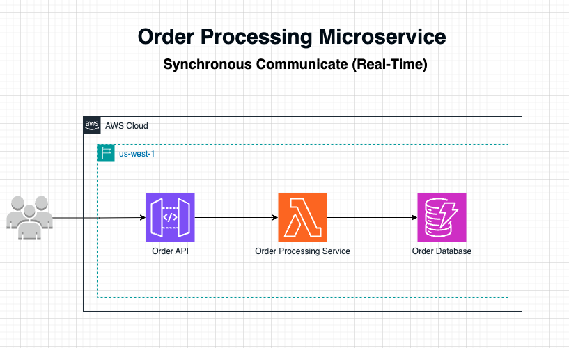

# Integrating API Gateway, Lambda and DynamoDB

## Architecture Diagram


## What is Serverless?
Serverless is a cloud computing execution model where the cloud provider automatically manages the infrastructure, allowing developers to focus solely on code. In a serverless architecture, resources are dynamically allocated as needed, and there is no need to provision or manage servers. This model enhances scalability, reduces operational overhead, and helps lower costs, as you only pay for the exact resources used during execution.

## Why a Serverless Architecture?
A serverless architecture is chosen here to achieve scalability, cost-efficiency, and a focus on application logic without worrying about infrastructure management. By using serverless components, this architecture can handle variable workloads, with each service scaling automatically based on demand.

---

### Description of Each AWS Serverless Service

1. **Amazon API Gateway (Order API)**:
   - **Description**: Amazon API Gateway is a fully managed service that enables developers to create, publish, maintain, monitor, and secure APIs at any scale. It acts as a "front door" for applications to access data, business logic, or functionality from backend services.
   - **Role in Architecture**: Here, API Gateway exposes the `Order API`, which acts as an entry point for users to place orders. It routes incoming HTTP requests to the `Order Processing Service`.

2. **AWS Lambda (Order Processing Service)**:
   - **Description**: AWS Lambda is a serverless compute service that runs code in response to events and automatically manages the compute resources required by that code. It supports a wide variety of programming languages and integrates seamlessly with other AWS services.
   - **Role in Architecture**: In this setup, Lambda functions act as the `Order Processing Service`, designed as a microservice to handle the specific business logic of processing orders. As a microservice, it is independently deployable and scalable, focusing solely on order-related functionality. This approach provides several benefits:
     - **Single Responsibility**: Lambda only processes orders, making it easier to maintain and evolve.
     - **Independent Scaling**: It can scale up or down based on order volume without affecting other parts of the application.
     - **Cost-Effectiveness**: Lambda functions are triggered only when needed, allowing the service to process orders on-demand, which minimizes costs.

   This microservice approach within a serverless architecture enhances agility, reliability, and operational efficiency, aligning with best practices for building resilient, scalable cloud applications.

   The Order Processing Microservice will have the following functionalities:

- Create, update, and delete an item.
- Read an item.
- Scan an item.
- Other operations (echo, ping) not related to DynamoDB, that you can use for testing.

The request payload you send in the POST request identifies the DynamoDB operation and provides necessary data. For example:

The following is a sample request payload for a DynamoDB create item operation:

```json
{
    "operation": "create",
    "tableName": "lambda-apigateway",
    "payload": {
        "Item": {
            "id": "1234ABCG",
            "price": 78.89,
            "product": "Beautiful Jacket",
            "order_date": "2024-11-04T10:30:00Z"
        }
    }
}
```
The following is a sample request payload for a DynamoDB read item operation:

```json
{
    "operation": "list",
    "tableName": "lambda-apigateway",
    "payload": {}
}

```

3. **Amazon DynamoDB (Order Database)**:
   - **Description**: Amazon DynamoDB is a fully managed NoSQL database service that provides fast and predictable performance with seamless scalability. It is designed to handle large volumes of data and allows flexible schema structures.
   - **Role in Architecture**: The `Order Database` is implemented using DynamoDB, where order data is stored in a fast, reliable, and scalable manner. This ensures that order information is readily available for processing and retrieval.

---


