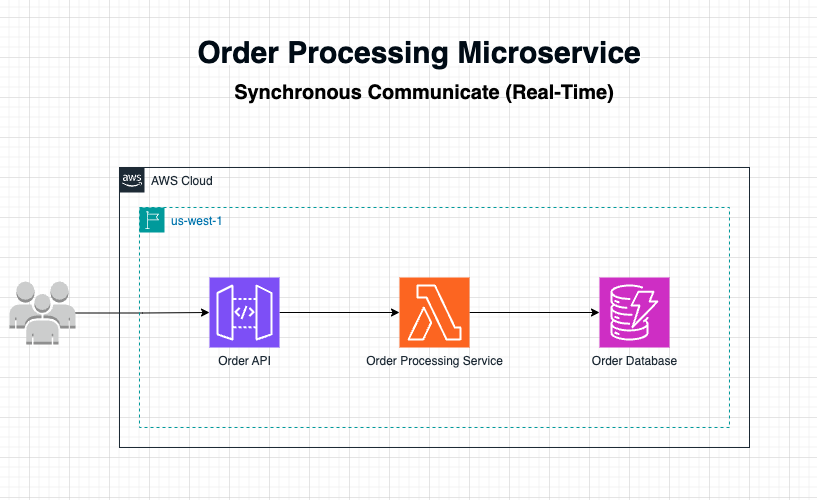
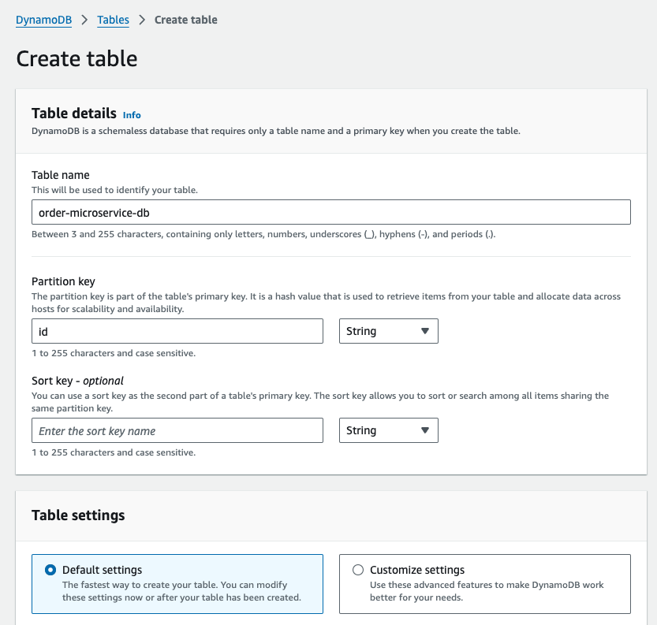
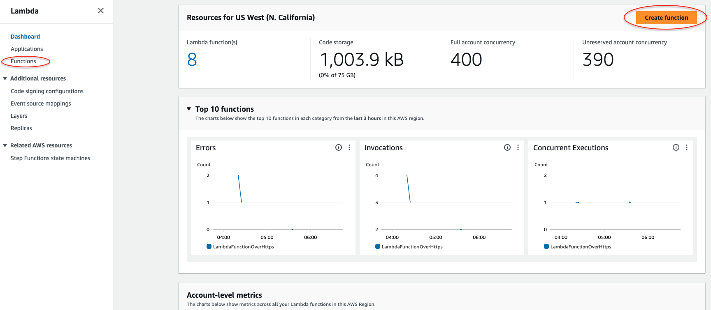
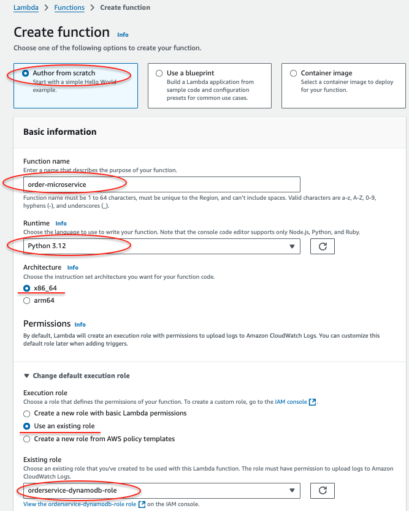
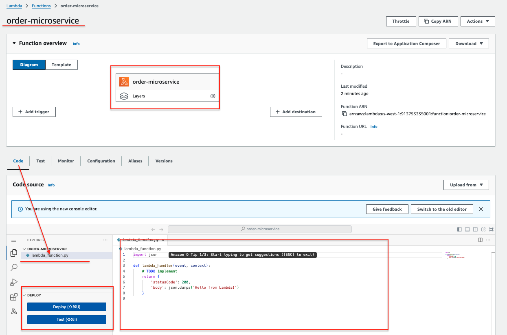

# Integrating API Gateway, Lambda and DynamoDB

## Architecture Diagram


## What is Serverless?
Serverless is a cloud computing execution model where the cloud provider automatically manages the infrastructure, allowing developers to focus solely on code. In a serverless architecture, resources are dynamically allocated as needed, and there is no need to provision or manage servers. This model enhances scalability, reduces operational overhead, and helps lower costs, as you only pay for the exact resources used during execution.

## Why a Serverless Architecture?
A serverless architecture is chosen here to achieve scalability, cost-efficiency, and a focus on application logic without worrying about infrastructure management. By using serverless components, this architecture can handle variable workloads, with each service scaling automatically based on demand.

---

### Description of Each AWS Serverless Service

1. **Amazon API Gateway (Order API)**:
   - **Description**: Amazon API Gateway is a fully managed service that enables developers to create, publish, maintain, monitor, and secure APIs at any scale. It acts as a "front door" for applications to access data, business logic, or functionality from backend services.
   - **Role in Architecture**: Here, API Gateway exposes the `Order API`, which acts as an entry point for users to place orders. It routes incoming HTTP requests to the `Order Processing Service`.

2. **AWS Lambda (Order Processing Service)**:
   - **Description**: AWS Lambda is a serverless compute service that runs code in response to events and automatically manages the compute resources required by that code. It supports a wide variety of programming languages and integrates seamlessly with other AWS services.
   - **Role in Architecture**: In this setup, Lambda functions act as the `Order Processing Service`, designed as a microservice to handle the specific business logic of processing orders. As a microservice, it is independently deployable and scalable, focusing solely on order-related functionality. This approach provides several benefits:
     - **Single Responsibility**: Lambda only processes orders, making it easier to maintain and evolve.
     - **Independent Scaling**: It can scale up or down based on order volume without affecting other parts of the application.
     - **Cost-Effectiveness**: Lambda functions are triggered only when needed, allowing the service to process orders on-demand, which minimizes costs.

   This microservice approach within a serverless architecture enhances agility, reliability, and operational efficiency, aligning with best practices for building resilient, scalable cloud applications.

   The Order Processing Microservice will have the following functionalities:

      - Create, update, and delete an item.
      - Read an item.
      - Scan an item.
      - Other operations (echo, ping) not related to DynamoDB, that you can use for testing.
      
      The request payload you send in the POST request identifies the DynamoDB operation and provides necessary data. For example:
      
      The following is a sample request payload for a DynamoDB create item operation:
      
      ```json
      {
          "operation": "create",
          "tableName": "order-microservice-db",
          "payload": {
              "Item": {
                  "id": "1234ABCG",
                  "price": 78.89,
                  "product": "Beautiful Jacket",
                  "order_date": "2024-11-04T10:30:00Z"
              }
          }
      }
      ```
      The following is a sample request payload for a DynamoDB read item operation:
      
      ```json
      {
          "operation": "list",
          "tableName": "order-microservice-db",
          "payload": {}
      }
      
      ```

3. **Amazon DynamoDB (Order Database)**:
   - **Description**: Amazon DynamoDB is a fully managed NoSQL database service that provides fast and predictable performance with seamless scalability. It is designed to handle large volumes of data and allows flexible schema structures.
   - **Role in Architecture**: The `Order Database` is implemented using DynamoDB, where order data is stored in a fast, reliable, and scalable manner. This ensures that order information is readily available for processing and retrieval.

---
## Setup
### 1. Create an IAM Role.
   This role provides the Lambda i.e. Order Proecssing Microservice permission to perform operations on AWS Services such as DynamoDB i.e. Order Database and CloudWatch.
   Go to IAM in the AWS Console, Click `Policies` on the left hand panel, then `Create policy` button on the top right hand corner. In the Specify permissions screen, click on `JSON` next to `Visual`       
   button on the top righ hand corner. The `Policy editor` opens up, copy and paste the following policies. Click `Next` button and give it name as `orderservcie-dynamodb-policy` and click `Create policy`.

  Once the `orderservcie-dynamodb-policy` is created, lets create a role by clicking `Role` on the left hand  and click `Create role` on the top right hand corner. In the `Select trusted entity` page, 
  select `AWS service`, choose `lambda` under the `Use case` and click `Next`. In the `Add permission`, type `orderservcie-dynamodb-policy` in the search box, the policy you created will pop up, select it 
  by checking the box and click `Next`. In the next page, give it role name `orderservice-dynamodb-role` and click `Create role`. If you click `Roles` and  type `orderservcie` in the search box, you should 
  see your `orderservice-dynamodb-role`.
   ```json
      {
         "Version": "2012-10-17",
         "Statement": [
         {
           "Sid": "Stmt1428341300017",
           "Action": [
             "dynamodb:DeleteItem",
             "dynamodb:GetItem",
             "dynamodb:PutItem",
             "dynamodb:Query",
             "dynamodb:Scan",
             "dynamodb:UpdateItem"
           ],
           "Effect": "Allow",
           "Resource": "*"
         },
         {
           "Sid": "",
           "Resource": "*",
           "Action": [
             "logs:CreateLogGroup",
             "logs:CreateLogStream",
             "logs:PutLogEvents"
           ],
           "Effect": "Allow"
         }
         ]
      }
   ```
### 2. Create DynamoDB i.e. Order database `order-microservice-db`
   Go to AWS DynamoDB console, click either `Dashboard` or `Tables` and `Create table`. In the `Create table` page, give it a name as `order-microservice-db` and partition key as `id` of type `String` as shwon in the screen then click `Create table` button.
   

### 3. Create Lambda Function i.e. Order Microservice `order-microservice`
   Go AWS Lambda Console, `Dashboard` and click `Create function`. 
   

   In the `Create function` page, select `Author from scratch` and give function name as `order-microservice`. Choose runtime as `Python 12` or the latest version, leave the architecture as default, configure the  `Permission` by selecting the roel you created earlier which is `orderservice-dynamodb-role` and click `Create function`.
   
   Once the `order-microservice` is created, the `order-microservice` page will show up as shown below -
   

   Replace the defaut lambda code with the following code copying and pasting it in the code editior. Once you replace the default code with the codes below, click `Deploy` button next to the code editor on the left side.

   ```json
      from __future__ import print_function
      import boto3
      import json
      from decimal import Decimal

      print('Loading function')


      def convert_floats_to_decimals(obj):
         if isinstance(obj, list):
            return [convert_floats_to_decimals(i) for i in obj]
         elif isinstance(obj, dict):
            return {k: convert_floats_to_decimals(v) for k, v in obj.items()}
         elif isinstance(obj, float):
            return Decimal(str(obj))
         else:
            return obj


      def lambda_handler(event, context):
         '''Provide an event that contains the following keys:

            - operation: one of the operations in the operations dict below
            - tableName: required for operations that interact with DynamoDB
            - payload: a parameter to pass to the operation being performed
         '''
         # Convert any float values in the payload to Decimal
         event['payload'] = convert_floats_to_decimals(event.get('payload', {}))

         operation = event['operation']

         if 'tableName' in event:
            dynamo = boto3.resource('dynamodb').Table(event['tableName'])

         operations = {
            'create': lambda x: dynamo.put_item(**x),
            'read': lambda x: dynamo.get_item(**x),
            'update': lambda x: dynamo.update_item(**x),
            'delete': lambda x: dynamo.delete_item(**x),
            'list': lambda x: dynamo.scan(**x),
            'echo': lambda x: x,
            'ping': lambda x: 'pong'
         }

         if operation in operations:
            return operations[operation](event.get('payload'))
         else:
            raise ValueError('Unrecognized operation "{}"'.format(operation))

   ```

